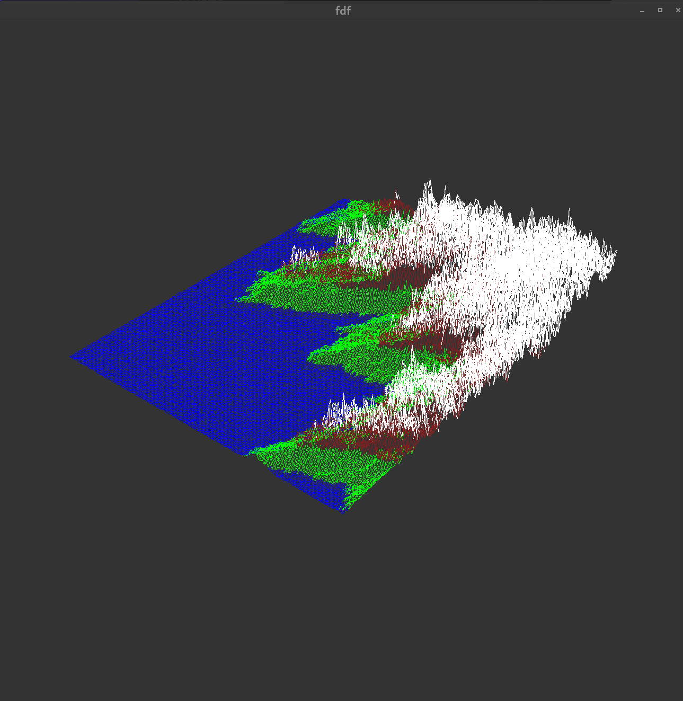

# FDF - Fil de Fer (Wireframe Model)

This project is about creating a simple wireframe model of a landscape. 

The representation in 3D of a landscape is a critical aspect of modern mapping. For example, in these times of spatial exploration, to have a 3D representation of Mars is a prerequisite condition to its conquest.

## Project Overview

This project uses a graphical library called MLX42. This library can be found from GitHub and needs to be cloned in a directory called `lib`.

### Input

As an input, the program takes a file which is the map it is going to draw. The map consists of coordinates where the number tells the height. For example, `0 5 0` would be three units on the x-axis, one unit on the y-axis, and 0, 5, and 0 for the z-axis. The program also reads RGB values attached to the z-values in the map (see examples in test maps). The program does not validate the map, so it is the user's responsibility to provide a valid map as input.

### Controls

- **Arrows**: Move the frame in different directions
- **Mouse wheel**: Zoom the frame
- **1 & 2**: Change the height multiplier

### Demo pic

## Reflections

This was the first graphics project I have done, and I really enjoyed it. It took me a while to finish this because I did not have a clear plan for it. I started with the idea that I wanted to draw a line and then a 2D grid, but that was not the most efficient way. I faced some trouble when I wanted to add the 3rd element to it. I ended up using the trigonometric approach for the 3D illusion, but if I were to do the project again, I would probably try using matrices. After all, it's a learning journey, and I really discovered new things during this process.

## Credits
- Developed by: @eleekku
- Built using:
  - **MLX42** ([https://github.com/codam-coding-college/MLX42])
